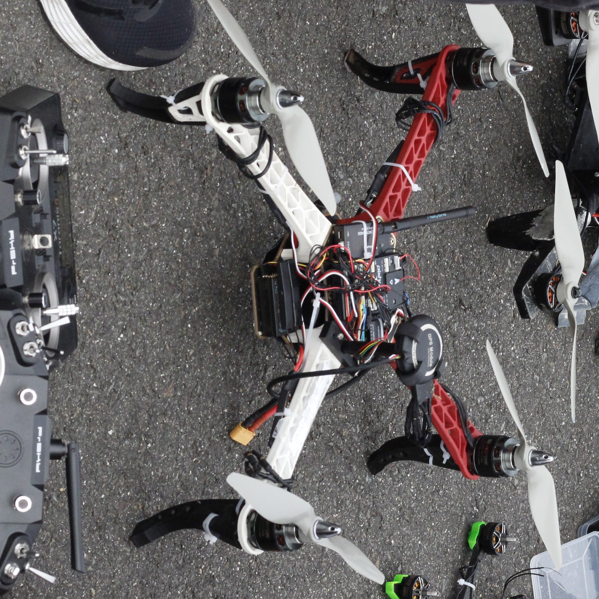

# CBR 2023 - Flying Robots League

Repository to add codes for the CBR 2023. The competition consisted of 4 phases. The team reached fifth place, scoring in phase 3. The team's Software technology consisted of the use of **Ardupilot, Lua Scripts, Dronekit, OpenCV and YOLO v5**. Innovations brought by the team in the competition were, for example, **precision landing**, the use of a synthetic dataset created in **Blender** to detect bases.

Due to time and logistics limitations, phases 1, 2 and 3 (...)

The repository is divided into:

* `challenges`: official IMAV's documents of the competition challenges and rules
* `deliverables`: codes used to format the phase deliverables, as well as some test and proof results
* `fase2`, `fase4` and `fase5`: directory with test codes and final versions of each respective phase
* `geofence`: geofence lua code and its explanation
* `lua_scripts`: lua scripts used on all flight controllers&#x20;
* `missions`: missions created `.plan` for each of the phases
* &#x20;`sd_card`: important settings used on sd cards, mainly in relation to the Raspberry camera

<figure><figcaption>
<em>Photo taken in the outdoor competition</em>
</figcaption></figure>

## Phase 1: Flight to the Search Area (endurance)

In this mission element, the task was to fly as far as possible around an arbitrary course inside the mission area. In this task, we created a trajectory between two points that were on the edge of the `geofence`, trying to create the longest straight line between two points within the area, maximizing the flight speed. The trajectory plan is uploaded in the `missions` folder and the result log can be viewed in the `deliverables` folder.

<figure><figcaption>
<em>F450: Drone used in phase 1</em>
</figcaption></figure>

## Phase 2: Inspect geographic characteristics (mapping and identification)

In this mission element, teams had to locate four a priori known objects on the ground and create an ortho map with which the track of the hikers can be reconstructed. We used the Agisoft Metashape Pro software to create the map. In tests, it was possible to build maps of reasonable quality. On the day of the test, due to the low quality of the photos, the map processing was hampered. Examples can be seen in the `deliverables` folder. Furthermore, in the `fase2` folder, all mapping and post-processing codes are present. In the `missions` folder, you can see the survey planned for the phase.

<figure><figcaption>
<em>Condor: Drone used in phase 2</em>
</figcaption></figure>

## Phase 3: Dynamic Inspection of identified potential locations and finding missing groups (dynamic mission planning):

In this mission element, four waypoints had to be reached in an apriori unknown waypoint sequence. The problem was that the waypoints would be given when the drone was already flying and far away, making communication difficult. It was not necessary to use an on-board computer. We only relied on Lua codes on the controller and Ardupilot parameters to avoid objects in the field and create optimized trajectories, using, for example, the Dijkstra's algorithm.&#x20;

<figure><figcaption>
<em>Tixa</em>: Autonomous FPV planned to be used in phase 3
</figcaption></figure>

## Phase 4: Identify the health state and quantity of hikers (object recognition):&#x20;

In this mission element, the task was to fly to a known position and identify the number and state (lying on the ground, standing, sitting) the hikers are in. In this task, a synthetic dataset was created with blender and **YOLO v5** was used to train an AI to detect blue dummies that needed to be rescued. The mission for phase 4 is available in the `missions` folder and all image processing is in the `fase4` folder, including the YOLO weights.

<figure><figcaption>
<em>Morcego: Drone planned to be used in phase 4 and 5</em>
</figcaption></figure>

## Phase 5: Aerial support for the rescue force (dynamic flight speeds)

In this mission, a MAV has to follow a rescue and assist the rescue team vehicle marked with an ArUco marker at an altitude of at least 5 m above the vehicle. This was probably the most difficult phase to implement, due to the variation in vehicle speed. The drone would have to have its PID well adjusted to perform the task well, which would require a lot of tests with the car that was going to be used. The codes for this phase are in the `fase5` folder.

<figure><figcaption>
<em>Our team adjusting the drone's takeoff. In the background, you can see the phase 5 vehicle.</em>
</figcaption></figure>
