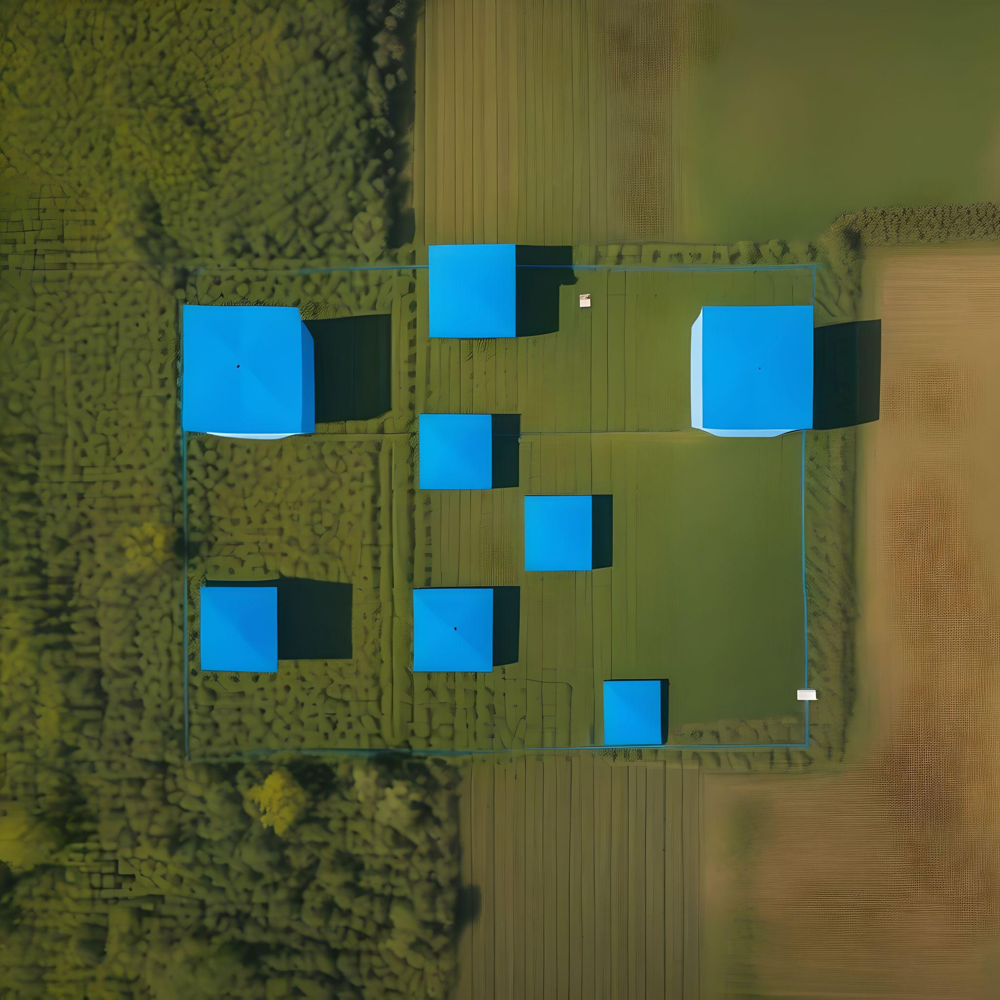
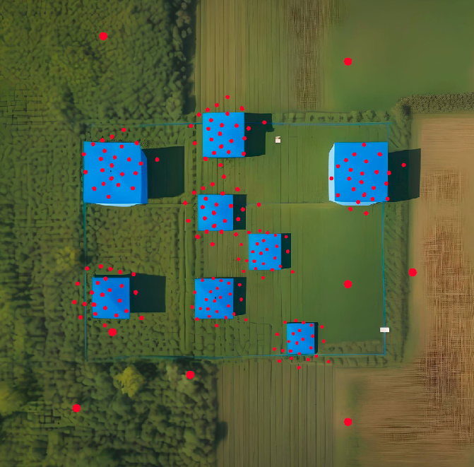

# Clustering

In phase 2, we needed to detect blue squares and give their coordinates with an accuracy of 20 meters. So, the idea of the codes in this folder is to first detect the squares using the `test_square.py` file, with the YOLO weights square.pt. This code detects and creates a coordinates file.txt with these coordinates. Then, we run the `yolo_cluster.py` code to create the so-called "clusters" and find the squares with the output given.

In this documentation, we'll briefly explain how `yolo_cluster.py` code works and give a brief review of the concept of "clusters."

### Instructions

Run the `test_square.py` inside your YOLO v5 folder and redirect so that the coordinate file falls into your workspace. Then, within your desired workspace, run the `yolo_cluster.py`, making the necessary modifications to the path and number of clusters.

### How to get the coordinates of each square?

<figure><figcaption>
<em>AI generated picture to simulate what should we detect</em>
</figcaption></figure>

Imagine that you are mapping a field and have received the coordinates of the photos in which objects have been detected. How can we find out the coordinates of each one and how many there are, just with the coordinates receiven? That's where the usefulness of the clustering process comes in. If you've ever done statistics, you're already familiar with hypothesis testing. For example, within a certain confidence interval, would a population A have the same characteristics as a population B? Well, now think about that for our case. Within a certain confidence interval, is the photo A taken of the same object as another photo B?  The analysis done on the code was not so complete as to consider gps uncertainties. Here, we use the k-means clustering technique. The **K means clustering** algorithm divides a set of _n_ observations into _k_ clusters. The method works by finding the nearest mean (cluster centers or cluster centroid) to each observation, which serves as a prototype of the cluster.

<figure><figcaption>
<em>Representation of what the detections should look like</em>
</figcaption></figure><figure><figcaption>
<em>Representation of what the process of clustering should look like based on the coordinates file</em>
</figcaption></figure>

Since we knew that the number of clusters was four, this makes it easier to apply the algorithm. The code still needs more testing to be trusted.

